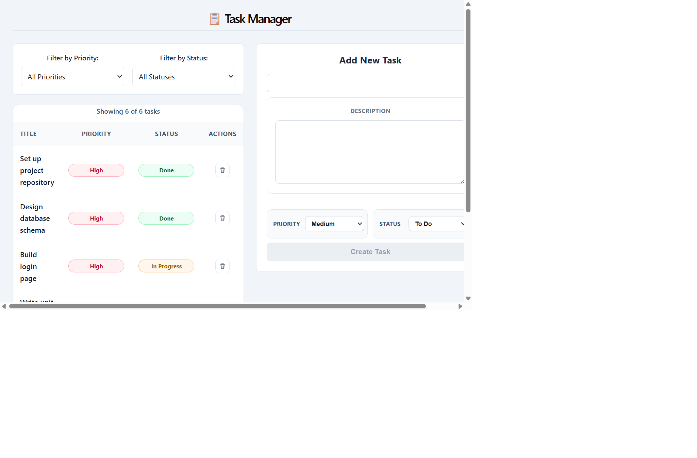
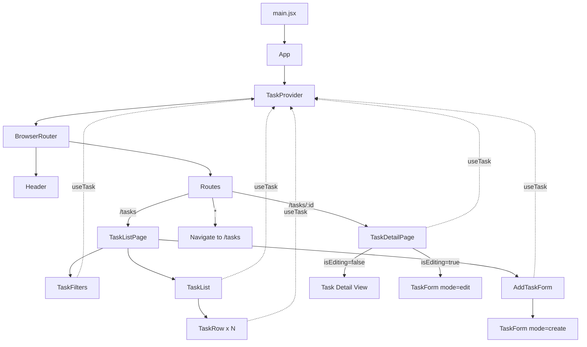
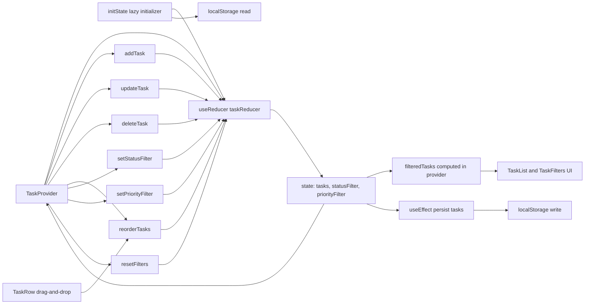

# Task Manager (React + Vite)

Simple task management app built with React, Context API, and reducer-based state management.

## How To Install And Run

### Prerequisites

- Node.js 18+
- npm 9+

### Install

```bash
npm install
```

### Run in development mode

```bash
npm run dev
```

Open the app at the local URL shown in your terminal (i.e. `http://127.0.0.1:5173` or similar).

### Build for production

```bash
npm run build
```

### Preview production build

```bash
npm run preview
```

## Screenshot (Main Features)

Main features shown: status filters, task table (Title/Status/Priority), delete actions, and add-task form.



## Architecture Diagrams

### React Component Design Diagram



### State and Data Flow Diagram



## Bonus Challenges Completed

### Easy

- [x] Show a task count summary above the list: "Showing X of Y tasks"
- [x] Disable the Add Task form's submit button while any required field is empty

### Medium

- [x] Persist tasks in `localStorage` so they survive a page reload (use a lazy `useState` initialiser or `useEffect` in `TaskContext`)

`loadInitialTasks()` ran while creating `initialState` at module load, making it eager. Moving it to `initState()`, it runs through `useReducer` initialization, making it lazy.

- [x] Add an `UPDATE_TASK` action and an inline edit form on the detail page

Both add and update task functions use a shared `TaskForm` component

- Fields and layout are identical
- Easier UI updates
- Less duplicated code
- Faster feature work

### Hard

- [x] Add drag-and-drop reordering of tasks in the list using only browser drag events (no library)

Implemented a drag-depth counter pattern on the task row `<tr>` to prevent flicker casued by the highlight state toggling. As the cursor crosses child element boundaries, the browser recalculates drag targets. This produces parent-level enter/leave churn even while the cursor appears to be “inside the same row”. The visual highlight state depends on the boolean `isDraggingOver`. These enter/leave churn flips the boolean many times per second, causing the recalculate/repaint of the element style, resulting in the flicker.

The drag-depth counter solves this by only clearing highlight when the cursor truly exits the whole row (drag depth returns to 0).

- [x] Add a priority filter on top of the status filter, so both can be active at the same time

The previous `status` filter and new `priority` filter have been combined into a single `TaskFilters` component

Added a clear all filters button to remove both `status` and `priority` filters
